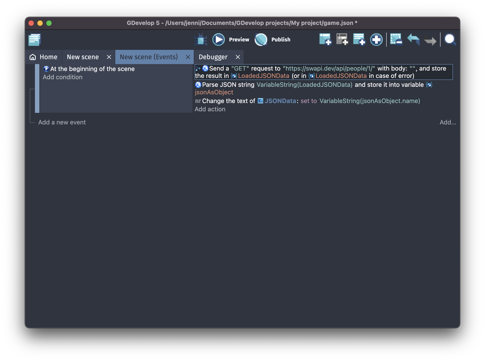

# GDevelop parse JSON object
Sample code to parse a JSON object in Gdevelop, and access the object data.



## What it does
1. It loads sample API data from [SWAPI](https://swapi.dev/api/people/1/) and stores the result in the global variable `LoadedJSONData`.

The response looks something like this:

```json
{"name":"Luke Skywalker","height":"172","mass":"77","hair_color":"blond","skin_color":"fair","eye_color":"blue","birth_year":"19BBY","gender":"male","homeworld":"https://swapi.dev/api/planets/1/","films":["https://swapi.dev/api/films/1/","https://swapi.dev/api/films/2/","https://swapi.dev/api/films/3/","https://swapi.dev/api/films/6/"],"species":[],"vehicles":["https://swapi.dev/api/vehicles/14/","https://swapi.dev/api/vehicles/30/"],"starships":["https://swapi.dev/api/starships/12/","https://swapi.dev/api/starships/22/"],"created":"2014-12-09T13:50:51.644000Z","edited":"2014-12-20T21:17:56.891000Z","url":"https://swapi.dev/api/people/1/"}
```

2. The API-received JSON data/string is parsed into a structure and saved into a scene (?) variable called `jsonAsObject`. The variable was created as a structure, but I'm not sure if that matters for the parsing of the result.

3. The text of the scene variable `JSONData` is set to the `name` property received from SWAPI (should display `Luke Skywalker`).

Make sure to click the "Wait for action to be completed" toggle:

